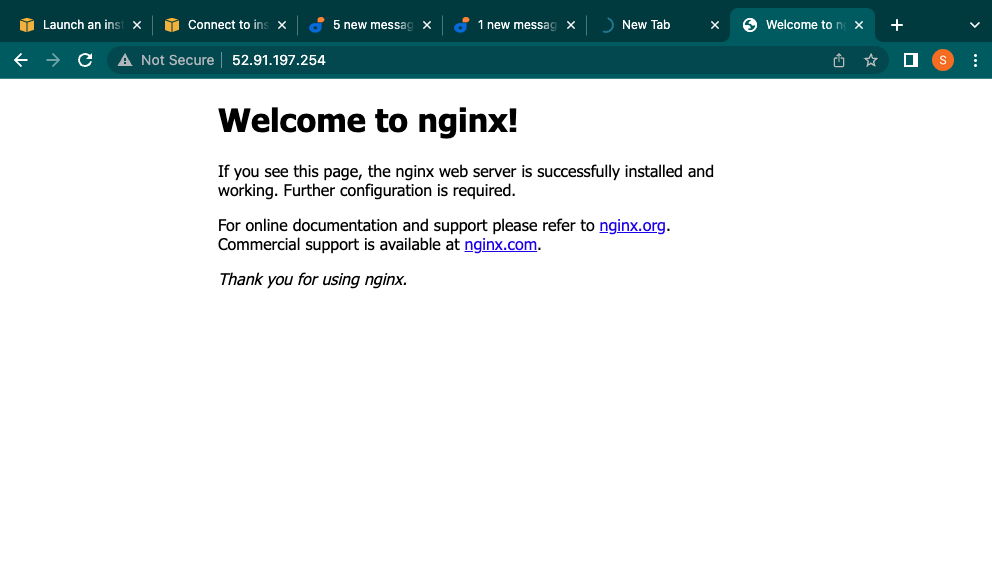
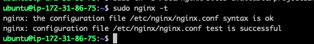
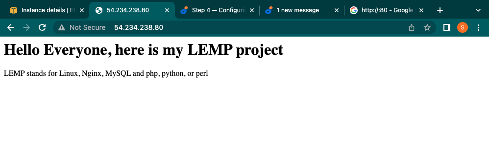
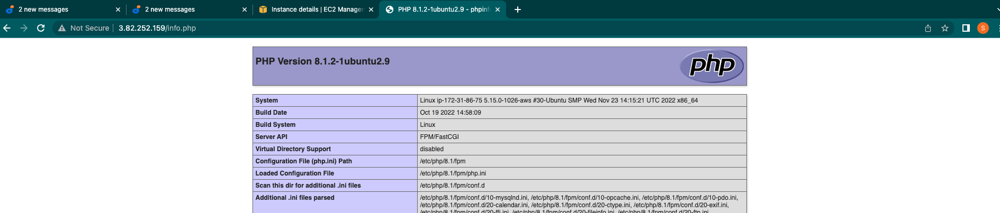
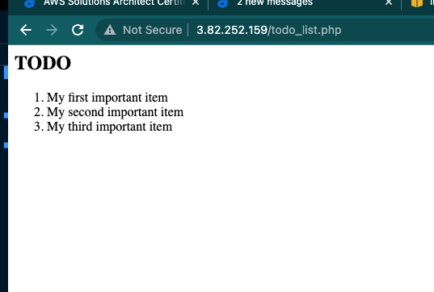

# LEMP IMPLEMENTATION

In this project we are to deploy a simple web application using the LEMP technology stack and should be accessible over the internet.

The LEMP technology stack stand for:

- L --> Linux
- E --> Nginx
- M --> MySQL
- P --> PHP or Python or Perl

## DevOps Technologies used

- AWS CLI --> [Command Line Interface](https://docs.aws.amazon.com/cli/latest/userguide/cli-chap-welcome.html)
- AWS EC2 --> [Elastic Cloud Compute](https://docs.aws.amazon.com/AWSEC2/latest/UserGuide/concepts.html)

## DEPLOYMENT PROCESS WITH SCREEN SHOTS

STEP 0: Create a free AWS account, Instantiate an EC2 and connect to it via SSH

STEP 1: INSTALLING THE NGINX WEB SERVER

- update apt and intall nginx

```bash
sudo apt update
sudo apt install nginx
```

- To verify that nginx was successfully installed and is running as a service in Ubuntu, run:

  ```bash
  sudo systemctl status nginx
  ```

- **Note:** Before we can receive any traffic by our Web Server, we need to open TCP port 80 which is default port that web brousers use to access web pages in the Internet.

- As we know, we have TCP port 22 open by default on our EC2 machine to access it via SSH, so we need to add a rule to EC2 configuration to open inbound connection through port 80:

- Then you can access it via `http://<Public-IP-Address>:80`



- Another way to retrieve your Public IP address, other than to check it in AWS Web console, is to use following command:

  ```bash
    curl -s http://169.254.169.254/latest/meta-data/public-ipv4
  ```

STEP 2: INSTALLING MYSQL

- To install MySQL use apt

  ```bash
  sudo apt install mysql-server
  ```

- To connect to MySQL use

  ```bash
  sudo mysql
  ```

- Set a password for the root user, using mysql_native_password as default authentication method. We’re defining this user’s password as PassWord.1.

  ```bash
  ALTER USER 'root'@'localhost' IDENTIFIED WITH mysql_native_password BY 'PassWord.1';
  ```

- It’s recommended that you run a security script that comes pre-installed with MySQL, then follow the prompt.

  ```bash
  sudo mysql_secure_installation
  ```

- When you’re finished, test if you’re able to log in to the MySQL console with the new password you set type the following command:

  ```bash
  sudo mysql -p
  ```

STEP 3: INSTALLING PHP

While Apache embeds the PHP interpreter in each request, Nginx requires an external program to handle PHP processing and act as a bridge between the PHP interpreter itself and the web server. They are:

- php-fpm: which stands for “PHP fastCGI process manager”, and tell Nginx to pass PHP requests to this software for processing
- php-mysql: a PHP module that allows PHP to communicate with MySQL-based databases
- To install these 2 packages at once, run:

  ```bash
  sudo apt install php-fpm php-mysql
  ```

STEP 4: CONFIGURING NGINX TO USE PHP PROCESSOR

- We need to create a server blocks to encapsulate configuration details and host more than one domain on a single server

- On Ubuntu 20.04, Nginx has one server block enabled by default and is configured to serve documents out of a directory at /var/www/html. While this works well for a single site, it can become difficult to manage if you are hosting multiple sites. Instead of modifying /var/www/html, we’ll create a directory structure within /var/www for the your_domain website, leaving /var/www/html in place as the default directory to be served if a client request does not match any other sites.

- Create the root web directory for your_domain as follows:

  ```bash
    sudo mkdir /var/www/projectLEMP
  ```

- Next, assign ownership of the directory with the $USER environment variable, which will reference your current system user:

  ```bash
    sudo chown -R $USER:$USER /var/www/projectLEMP
  ```

- Then, open a new configuration file in Nginx’s sites-available directory

  ```bash
  sudo vim /etc/nginx/sites-available/projectLEMP
  ```

- This will create a new blank file. Paste in the following bare-bones configuration:

  ```bash
    #/etc/nginx/sites-available/projectLEMP
    server {
        listen 80;
        server_name projectLEMP www.projectLEMP;
        root /var/www/projectLEMP;

        index index.html index.htm index.php;

        location / {
            try_files $uri $uri/ =404;
        }

        location ~ \.php$ {
            include snippets/fastcgi-php.conf;
            fastcgi_pass unix:/var/run/php/php8.1-fpm.sock;
        }

        location ~ /\.ht {
            deny all;
        }

    }
  ```

  Learn more on above configuration [here](docs/nginx-config.md)

- Activate your configuration by linking to the config file from Nginx’s sites-enabled directory:

  ```bash
    sudo ln -s /etc/nginx/sites-available/projectLEMP /etc/nginx/sites-enabled/
  ```

- This will tell Nginx to use the configuration next time it is reloaded. You can test your configuration for syntax errors by typing:

  ```bash
    sudo nginx -t
  ```

  

- We also need to disable default Nginx host that is currently configured to listen on port 80, for this run:

  ```bash
    sudo unlink /etc/nginx/sites-enabled/default
  ```

- When you are ready, reload Nginx to apply the changes:

  ```bash
    sudo systemctl reload nginx
  ```

- Your new website is now active, but the web root /var/www/projectLEMP is still empty. Create an index.html file in that location so that we can test that your new server block works as expected:

  ```bash
    sudo echo 'Hello LEMP from hostname' $(curl -s http://169.254.169.254/latest/meta-data/public-hostname) 'with public IP' $(curl -s http://169.254.169.254/latest/meta-data/public-ipv4) > /var/www/projectLEMP/index.html
  ```

- Now go to your browser and try to open your website URL using IP address:

  ```bash
    http://<Public-IP-Address>:80
    # or
    http://<Public-DNS-Name>:80
  ```

  

STEP 5: TESTING PHP WITH NGINX

To validate that Nginx can correctly hand `.php` files off to our PHP processor

- Let create a file called `info.php`

  ```bash
  sudo vim /var/www/projectLEMP/info.php
  # Then paste
  <?php
  phpinfo();
  ```

- You can now access the page on

  ```bash
  http://<server_domain_or_IP>/info.php
  ```

  

STEP 6: RETRIEVING DATA FROM MYSQL DATABASE WITH PHP (CONTINUED)

We want to create a `Todo list` database

- First, connect to the MySQL console using the root account

  ```bash
  sudo mysql

  # create a database
  mysql> CREATE DATABASE `example_database`;
  ```

- Create user and grant access to that user

  ```bash
  mysql>  CREATE USER 'example_user'@'%' IDENTIFIED WITH mysql_native_password BY 'password';

  # Grant Privilege access
  mysql> GRANT ALL ON example_database.* TO 'example_user'@'%';

  ```

- Create a table and insert data into it

  ```bash
  CREATE TABLE example_database.todo_list (
    item_id INT AUTO_INCREMENT,
    content VARCHAR(255),
    PRIMARY KEY(item_id));

    # INSERT DATA INTO THE TABLE
    mysql> INSERT INTO example_database.todo_list (content) VALUES ("My first important item");
  ```

- Lastly create a php file to query the db and display the data

  ```bash
  # Create a PHP file
  vim /var/www/projectLEMP/todo_list.php

  # Add a PHP code to query the DB
  <?php
  $user = "example_user";
  $password = "password";
  $database = "example_database";
  $table = "todo_list";

  try {
    $db = new PDO("mysql:host=localhost;dbname=$database", $user, $password);
    echo "<h2>TODO</h2><ol>";
    foreach($db->query("SELECT content FROM $table") as $row) {
      echo "<li>" . $row['content'] . "</li>";
    }
    echo "</ol>";
  } catch (PDOException $e) {
      print "Error!: " . $e->getMessage() . "<br/>";
      die();
  }
  ```

- Access the website here

  ```bash
  http://<Public_domain_or_IP>/todo_list.php
  ```


